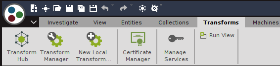
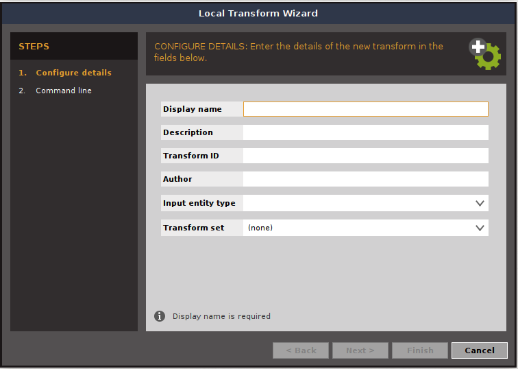
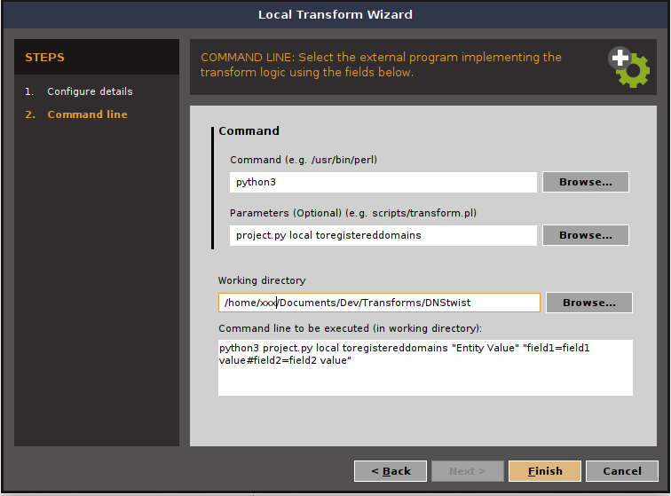
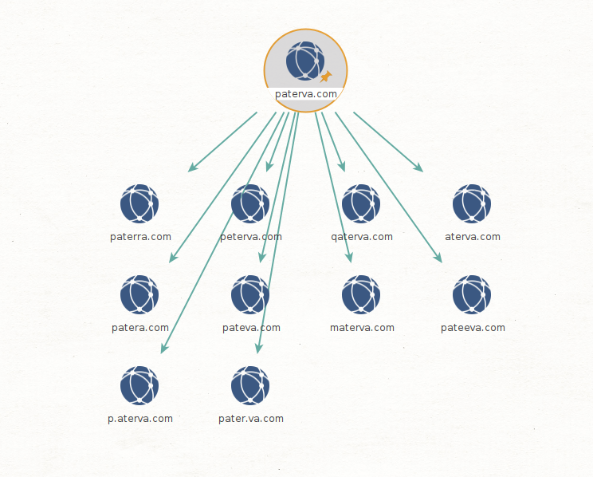

## Maltego DNSTwist Transforms

The Following Transforms are based on [dnstwist](https://github.com/elceef/dnstwist) as per their documentation "DNS fuzzing is an automated workflow for discovering potentially malicious domains targeting your organisation. This tool works by generating a large list of permutations based on a domain name you provide and then checking if any of those permutations are in use."

Maltego-TRX library [documentation](https://github.com/paterva/maltego-trx)

### Installation
`$ pip install -r requirements.txt`

### Maltego Setup

1. Open Maltego
2. Go to 'Transforms' on the top menu.
\
\
    \

3. Select New Local Transform
4. Fill the "Configure details" information
    - **Display Name:** To Registered Domains [DNStwist]
    - **Description:** Searches for Domain permutations and verifies that the domain is registered
    - **Transform ID:** my.registered_domains_dnstwist
    - **Author:** TURROKS
    - **Input entity type:** Domain [maltego.Domain]
    - **Transform set:** (none)
\
\
    
   

5. Fill the "Command Line" Information
    - **Command:** Enter the path to Python3
    - **Parameters:** project.py local toregistereddomains
    - **Working directory:** Enter the path to the git folder
\
\
    

### Running the Transforms

1. Open a new Graph
2. Drag and Drop a Domain into the Graph
3. Select the Domain
4. Right-click to get the Transforms menu
5. Local Transforms > To Registered Domains \[DNStwsit]
\
\
    
